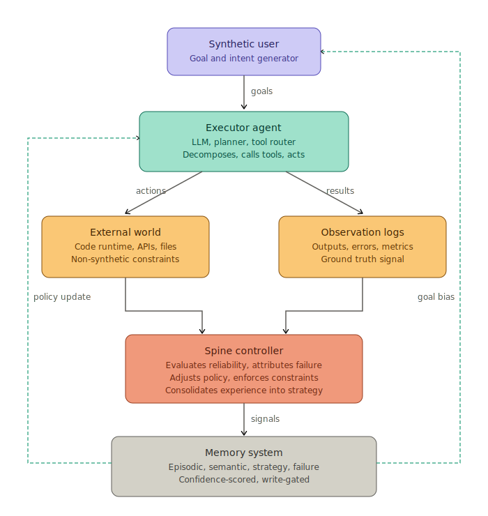

# Synthetic User

> A closed-loop agent architecture where one LLM generates intent, another executes, and a third evaluates reliability — all grounded by real-world feedback.

This is a **design-phase repository**. The architecture is locked. The code is not.

## What it is

Most agentic systems still have a human at the top: someone types a prompt, the agent acts, the human evaluates the result and types the next prompt. The human is doing real cognitive work — choosing what matters, noticing when something is off, deciding what to try next — but that work is invisible to the system.

Synthetic User is an experiment in replacing that human layer with a learned policy — not because humans should be removed, but because the substitution forces every assumption about what humans were doing into the open. The result is a three-component control loop:

- A **synthetic user** that generates goals and tasks under simulated constraints
- An **executor agent** that decomposes goals into tool-using action sequences
- A **spine controller** that evaluates outcomes and adjusts both upstream components

Bound together by an **external world** — real tools, real APIs, real error messages — that the loop cannot lie its way around.

## What it isn't

**Not an attempt to remove humans from agentic systems.** The synthetic user replaces a slice of cognition — goal suggestion under constraints — not the human's role as the actual beneficiary of the work.

**Not an alignment experiment.** The spine evaluates reliability, not morality. "Did this work?" not "was this good?"

**Not AGI.** Two LLMs in a loop with feedback is not a mind. It is a self-updating control system. That is interesting on its own terms.

**Not a continuation of [Growing Spine](https://github.com/Tubifix77/growing-spine).** Same era, same author, related lineage, different hypothesis. Growing Spine is a creature with one constraint and no enforcement layer. Synthetic User is a closed loop with explicit enforcement. They test different questions.

## Architecture

Five components, three layers of grounding:

1. **Synthetic user** generates a goal from current memory state
2. **Executor** decomposes the goal into tool-using actions
3. **External world** runs the actions and produces non-synthetic feedback
4. **Spine** evaluates the result, attributes failure, updates policy
5. **Memory** consolidates experience and feeds back into both upstream components

Full component definitions, data flows, and failure modes are in [architecture.md](architecture.md).

## The hypothesis being tested

Two LLMs talking to each other almost always collapse into a closed epistemic loop: internally coherent, externally wrong. The standard objection to multi-agent self-play is that it generates plausible nonsense at scale.

The claim this project tests: **a closed loop becomes stable when external reality is allowed to disagree with it often enough.**

Concretely — given a synthetic user + executor + spine + real tool execution + persistent memory, can the system improve at a non-trivial task over time without drifting into reward-hacking, hallucination ecosystems, or goal collapse?

If yes: this is a viable training-data-free agent improvement pattern.  
If no: the failure modes themselves are the contribution — they map the boundary between useful self-play and pure self-talk.

## Why the spine matters

The spine is not a moral filter. It is an **externalized consequence model**.

The simplest version of its job: estimate whether an action will increase or decrease the system's track record of doing useful work over time. Not "is this good" but "does this break reliability."

This framing matters because:

- Abstract ethics ("do no harm") collapse under ambiguity
- Reliability is measurable from external feedback alone
- The spine's incentive is aligned with system survival, which is aligned with continuing to produce useful output

The risk this framing introduces — "sociopath mode," where the system optimizes the appearance of reliability rather than reliability itself — is real, and is treated as a named failure mode (see architecture.md). The mitigation is structural, not motivational: hidden evaluation metrics, randomized audits, external verification the system cannot anticipate.

## Lineage

This project emerged from a multi-model conversation in May 2026, with contributions from Claude, ChatGPT, and Gemini. Each pushed against the others' framings, and the architecture is the surviving structure.

Conceptual ancestors:

- **Actor-critic architectures** (Sutton & Barto) — the spine is the critic
- **Self-play loops** (AlphaZero and successors) — the dual-LLM pattern
- **Reflection agents** (Shinn et al. 2023) — the spine's evaluation role
- **Tool-using agents with environmental feedback** (ReAct, Toolformer) — the grounding layer
- **Sovereignty, Spine Reborn, Skynet, Growing Spine** (this author) — the lineage of persistent-memory agents this builds on

## Status

Design-phase. No code yet, deliberately.

The architecture is locked enough to build against, but the open questions in [architecture.md](architecture.md#7-open-design-decisions) need to land before implementation starts. Top of the list: what the synthetic user actually does at cycle zero — is its goal distribution hand-seeded, sampled from a corpus, or learned from a few example human sessions?

## License

MIT. See [LICENSE](LICENSE).
